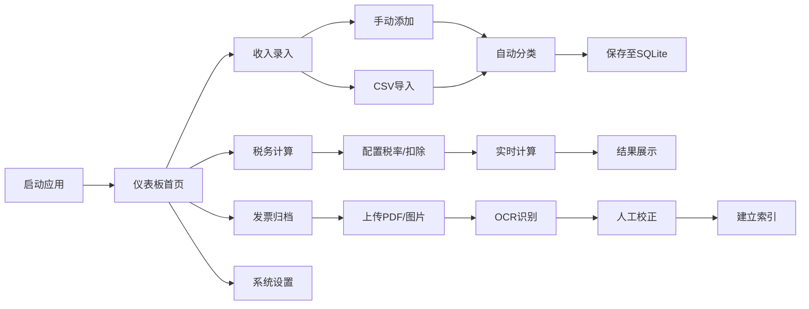

## 1. 产品概述

自由职业者个人税务估算与发票管理桌面应用，为自由职业者提供一站式收入记录、税务估算和发票归档解决方案。通过本地化数据存储保障用户隐私，自动化处理降低财务管理门槛。

- 目标用户：设计师、程序员、咨询师等自由职业者
- 核心价值：简化税务计算流程、智能归档发票、可视化财务数据
- 市场定位：轻量级、隐私优先的个人财务桌面工具

## 2. 核心功能

### 2.1 用户角色
| 角色 | 注册方式 | 核心权限 |
|------|----------|----------|
| 本地用户 | 无需注册，首次启动自动初始化 | 完全控制本地数据，所有功能可用 |

### 2.2 功能模块
1. **仪表板首页**：财务概览、收支趋势图表、快捷操作入口
2. **收入录入模块**：手动添加收入、CSV银行流水导入、智能分类标签
3. **税务计算器**：地区税率配置、累进个税计算、社保估算、自定义扣除项
4. **发票归档**：PDF/图片上传、OCR识别金额日期、本地搜索索引、分类管理
5. **设置中心**：税率表维护、扣除项管理、主题切换、数据备份

### 2.3 页面详情
| 页面名称 | 模块名称 | 功能描述 |
|---------|---------|----------|
| 仪表板 | 财务概览卡片 | 显示年度总收入、已预估税额、本月收入、发票数量统计 |
| 仪表板 | 趋势图表 | 月度收入柱状图、税种分布饼图 |
| 收入管理 | 收入列表 | 表格展示所有收入记录，支持筛选、排序、分页 |
| 收入管理 | 手动录入表单 | 输入金额、日期、来源类别、付款方、备注信息 |
| 收入管理 | CSV导入 | 选择银行流水CSV文件，映射字段，预览并批量导入 |
| 税务计算 | 参数配置区 | 选择地区、输入税前收入、配置社保基数和比例 |
| 税务计算 | 计算结果展示 | 实时显示应纳税所得额、各级税额、社保明细、税后收入 |
| 税务计算 | 扣除项管理 | 添加/编辑/删除专项附加扣除项目 |
| 发票归档 | 上传区域 | 拖拽或点击上传PDF/JPG/PNG发票文件 |
| 发票归档 | OCR识别 | 使用tesseract.js提取发票金额、日期、发票号 |
| 发票归档 | 发票列表 | 卡片式展示已归档发票，支持关键词搜索和分类筛选 |
| 设置 | 税率维护 | 自定义各地区累进税率表和速算扣除数 |
| 设置 | 主题偏好 | 深色/浅色主题切换，跟随系统选项 |
| 设置 | 数据管理 | 导出数据备份、导入历史数据、清空本地数据 |

## 3. 核心流程

### 3.1 收入录入流程
用户打开应用 → 进入收入管理 → 选择手动录入或CSV导入 → 填写/确认收入详情 → 系统自动分类 → 保存至本地数据库 → 更新仪表板统计

### 3.2 税务估算流程
用户进入税务计算器 → 选择所在地区 → 输入年度/月度收入 → 配置扣除项和社保参数 → 系统实时计算 → 展示详细税种明细和税后收入 → 可导出计算结果

### 3.3 发票归档流程
用户进入发票归档 → 拖拽或选择上传发票文件 → 系统自动进行OCR识别 → 提取金额/日期/发票号 → 用户可手动修正识别结果 → 建立本地搜索索引 → 支持关键词检索

## 4. 用户界面设计

### 4.1 设计风格
- **主色调**：深青绿色 #0D9488（专业、信任），搭配深紫蓝 #1E1B4B 作为深色模式基底
- **强调色**：琥珀橙 #F59E0B（数据高亮、警示提示）
- **按钮风格**：圆角 8px，微阴影，悬停时轻微上浮动画
- **字体**：标题使用 Inter SemiBold，正文使用 Inter Regular，等宽数据使用 JetBrains Mono
- **布局风格**：左侧垂直导航栏 + 右侧内容区域，卡片式模块化设计
- **图标风格**：线性简洁图标，统一 24px 尺寸，统一 stroke 宽度

### 4.2 页面设计概览
| 页面名称 | 模块名称 | UI元素 |
|---------|---------|--------|
| 仪表板 | 概览卡片 | 渐变背景卡片、数值大字、趋势小箭头、图标点缀 |
| 仪表板 | 图表区域 | Chart.js柱状图+饼图并排、响应式容器、动画加载 |
| 收入管理 | 数据表格 | 斑马纹行、悬停高亮、操作按钮行内展示 |
| 收入管理 | 录入表单 | 分组fieldset、标签左对齐、输入框带图标前缀 |
| 税务计算 | 参数面板 | 分组折叠面板、滑块+数字输入联动、实时反馈 |
| 税务计算 | 结果展示 | 分级税额进度条、总额大字展示、明细列表 |
| 发票归档 | 上传区 | 虚线边框拖放区域、文件图标、上传进度条 |
| 发票归档 | 发票卡片 | 缩略图网格、悬停显示详情、状态标签 |
| 设置 | 主题切换 | 开关组件、实时预览、三态选择（浅/深/跟随系统） |

### 4.3 响应式
- 桌面端优先设计（最小宽度 1200px）
- 导航栏可折叠为图标模式（800-1200px）
- 表格支持横向滚动，卡片在小屏幕下自动换行
- 触控设备优化按钮最小尺寸 44x44px

### 4.4 深色模式
- 背景渐变：从 #0F172A 到 #1E293B 的深蓝灰渐变
- 卡片背景：#1E293B 带 0.5 透明度毛玻璃效果
- 边框分隔：#334155 低对比度细线
- 文字层级：主文字 #F1F5F9，次要文字 #94A3B8，占位文字 #64748B
- 强调色保持不变，在深色背景下更突出
