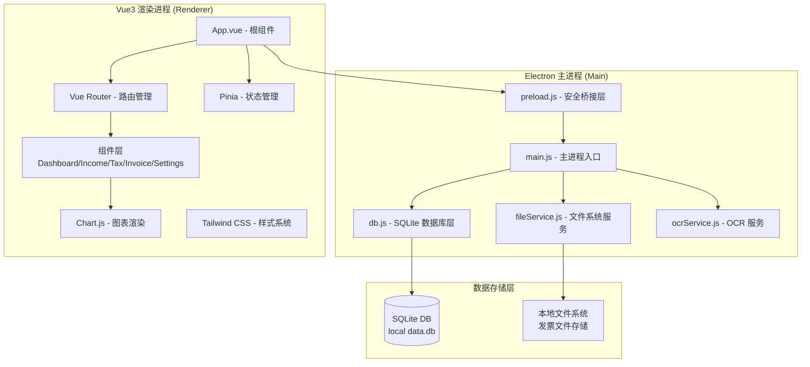
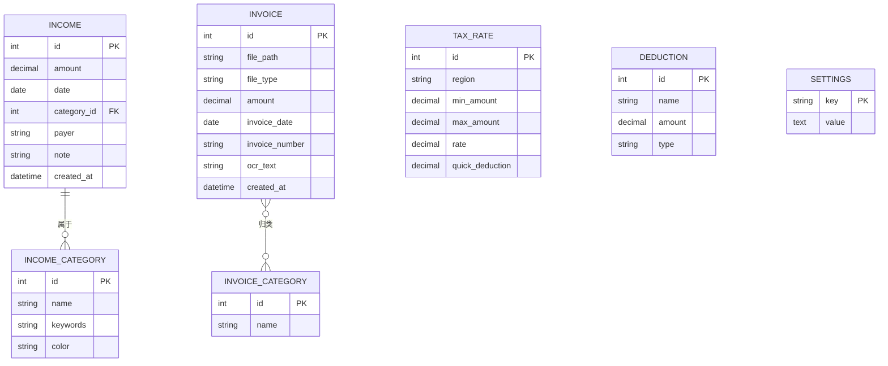

## 1. 架构设计



## 2. 技术栈描述

- **桌面框架**：Electron@29.x - 跨平台桌面应用容器
- **前端框架**：Vue@3.4.x + <script setup> Composition API
- **构建工具**：Vite@5.x + vite-plugin-electron
- **路由管理**：Vue Router@4.x
- **状态管理**：Pinia@2.x
- **样式方案**：Tailwind CSS@3.x + CSS 变量主题系统
- **图表库**：Chart.js@4.x + vue-chartjs
- **本地数据库**：better-sqlite3@9.x - 同步高性能 SQLite 驱动
- **OCR识别**：tesseract.js@5.x - 纯 JS 文字识别
- **CSV解析**：papaparse@5.x
- **PDF处理**：pdfjs-dist@4.x - 用于PDF转图片
- **图标库**：@heroicons/vue@2.x
- **包管理**：npm

## 3. 目录结构

```
freelance-tax-tracker/
├── .trae/documents/          # 设计文档
├── electron/                  # Electron 主进程代码
│   ├── main.js               # 主进程入口
│   ├── preload.js            # 预加载脚本（IPC桥接）
│   └── services/
│       ├── database.js       # SQLite 数据库初始化与查询
│       ├── fileService.js    # 文件系统操作
│       ├── ocrService.js     # OCR 识别服务
│       └── csvParser.js      # CSV 解析服务
├── src/                       # Vue 渲染进程代码
│   ├── main.js               # 渲染进程入口
│   ├── App.vue               # 根组件
│   ├── assets/               # 静态资源
│   │   └── styles/
│   │       └── tailwind.css  # Tailwind 入口与主题变量
│   ├── router/
│   │   └── index.js          # Vue Router 配置
│   ├── stores/               # Pinia 状态管理
│   │   ├── income.js
│   │   ├── tax.js
│   │   ├── invoice.js
│   │   └── settings.js
│   ├── components/           # 通用组件
│   │   ├── Layout/           # 布局组件（Sidebar, Navbar）
│   │   ├── common/           # 通用UI（Button, Modal, Card）
│   │   └── charts/           # 图表组件
│   ├── views/                # 页面视图
│   │   ├── Dashboard.vue
│   │   ├── Income.vue
│   │   ├── TaxCalculator.vue
│   │   ├── Invoices.vue
│   │   └── Settings.vue
│   └── utils/                # 工具函数
│       ├── taxCalculator.js  # 税务计算逻辑
│       ├── formatters.js     # 数字/日期格式化
│       └── ipc.js            # IPC 通信封装
├── data/                      # 本地数据目录（运行时创建）
│   ├── database.db           # SQLite 数据库文件
│   └── invoices/             # 发票文件存储
├── public/                    # 公共静态资源
├── .gitignore
├── package.json
├── vite.config.js
└── tailwind.config.js
```

## 4. 路由定义

| 路由路径 | 页面组件 | 用途 |
|---------|---------|------|
| / | Dashboard.vue | 仪表板首页 - 财务概览和图表 |
| /income | Income.vue | 收入管理 - 录入、导入、列表 |
| /tax | TaxCalculator.vue | 税务计算器 - 税额估算 |
| /invoices | Invoices.vue | 发票归档 - 上传、OCR、搜索 |
| /settings | Settings.vue | 系统设置 - 税率、主题、数据 |

## 5. IPC 通信接口定义

### 5.1 数据库操作（income 模块）
```javascript
// 渲染进程调用
ipcRenderer.invoke('income:create', { amount, date, category, payer, note })
ipcRenderer.invoke('income:list', { page, pageSize, filter })
ipcRenderer.invoke('income:update', id, data)
ipcRenderer.invoke('income:delete', id)
ipcRenderer.invoke('income:stats', { year, month })
ipcRenderer.invoke('income:importCsv', filePath, mapping)
```

### 5.2 税务配置
```javascript
ipcRenderer.invoke('tax:getRates', region)
ipcRenderer.invoke('tax:saveRates', region, rates)
ipcRenderer.invoke('tax:getDeductions')
ipcRenderer.invoke('tax:saveDeduction', deduction)
ipcRenderer.invoke('tax:deleteDeduction', id)
```

### 5.3 发票管理
```javascript
ipcRenderer.invoke('invoice:upload', { filePath, ocrData })
ipcRenderer.invoke('invoice:list', { keyword, category })
ipcRenderer.invoke('invoice:ocr', filePath)  // 触发OCR识别
ipcRenderer.invoke('invoice:get', id)
ipcRenderer.invoke('invoice:delete', id)
```

### 5.4 文件系统
```javascript
ipcRenderer.invoke('file:openDialog', { filters, properties })
ipcRenderer.invoke('file:saveDialog', { defaultPath })
ipcRenderer.invoke('file:readCsv', filePath)
ipcRenderer.invoke('file:exportData', exportPath)
```

### 5.5 系统设置
```javascript
ipcRenderer.invoke('settings:get')
ipcRenderer.invoke('settings:save', { theme, region, currency })
ipcRenderer.invoke('settings:exportDatabase')
ipcRenderer.invoke('settings:importDatabase', filePath)
```

## 6. 数据模型

### 6.1 ER 图



### 6.2 DDL 语句

```sql
-- 收入分类表
CREATE TABLE IF NOT EXISTS income_categories (
    id INTEGER PRIMARY KEY AUTOINCREMENT,
    name TEXT NOT NULL,
    keywords TEXT DEFAULT '',
    color TEXT DEFAULT '#0D9488',
    created_at DATETIME DEFAULT CURRENT_TIMESTAMP
);

-- 收入记录表
CREATE TABLE IF NOT EXISTS incomes (
    id INTEGER PRIMARY KEY AUTOINCREMENT,
    amount DECIMAL(12,2) NOT NULL,
    date DATE NOT NULL,
    category_id INTEGER,
    payer TEXT DEFAULT '',
    note TEXT DEFAULT '',
    created_at DATETIME DEFAULT CURRENT_TIMESTAMP,
    FOREIGN KEY (category_id) REFERENCES income_categories(id)
);

CREATE INDEX IF NOT EXISTS idx_incomes_date ON incomes(date);
CREATE INDEX IF NOT EXISTS idx_incomes_category ON incomes(category_id);

-- 税率表
CREATE TABLE IF NOT EXISTS tax_rates (
    id INTEGER PRIMARY KEY AUTOINCREMENT,
    region TEXT NOT NULL DEFAULT 'default',
    min_amount DECIMAL(12,2) NOT NULL DEFAULT 0,
    max_amount DECIMAL(12,2),
    rate DECIMAL(5,4) NOT NULL,
    quick_deduction DECIMAL(12,2) DEFAULT 0,
    level INTEGER
);

-- 扣除项表
CREATE TABLE IF NOT EXISTS deductions (
    id INTEGER PRIMARY KEY AUTOINCREMENT,
    name TEXT NOT NULL,
    amount DECIMAL(12,2) NOT NULL DEFAULT 0,
    type TEXT DEFAULT 'special',
    created_at DATETIME DEFAULT CURRENT_TIMESTAMP
);

-- 发票分类表
CREATE TABLE IF NOT EXISTS invoice_categories (
    id INTEGER PRIMARY KEY AUTOINCREMENT,
    name TEXT NOT NULL,
    created_at DATETIME DEFAULT CURRENT_TIMESTAMP
);

-- 发票表
CREATE TABLE IF NOT EXISTS invoices (
    id INTEGER PRIMARY KEY AUTOINCREMENT,
    file_path TEXT NOT NULL,
    file_type TEXT NOT NULL,
    amount DECIMAL(12,2),
    invoice_date DATE,
    invoice_number TEXT,
    category_id INTEGER,
    ocr_text TEXT,
    search_index TEXT,
    created_at DATETIME DEFAULT CURRENT_TIMESTAMP,
    FOREIGN KEY (category_id) REFERENCES invoice_categories(id)
);

CREATE INDEX IF NOT EXISTS idx_invoices_search ON invoices(search_index);
CREATE INDEX IF NOT EXISTS idx_invoices_date ON invoices(invoice_date);

-- 系统设置表
CREATE TABLE IF NOT EXISTS settings (
    key TEXT PRIMARY KEY,
    value TEXT
);

-- 初始化默认数据
INSERT OR IGNORE INTO income_categories (name, keywords, color) VALUES
('设计费', '设计,design,UI,平面,视觉', '#8B5CF6'),
('咨询费', '咨询,consult,顾问,advisory', '#0D9488'),
('开发费', '开发,develop,代码,program,编程', '#3B82F6'),
('写作费', '写作,write,文案,content', '#F59E0B'),
('翻译费', '翻译,translate,interpret', '#EC4899'),
('其他收入', '其他,other', '#6B7280');

INSERT OR IGNORE INTO invoice_categories (name) VALUES
('办公用品'), ('差旅费'), ('餐饮费'), ('通讯费'), ('其他');

INSERT OR IGNORE INTO settings (key, value) VALUES
('theme', 'dark'),
('region', 'default'),
('currency', 'CNY'),
('social_insurance_base', '0'),
('social_insurance_rate', '0.105');
```

## 7. 税务计算逻辑说明

### 7.1 个税累进计算
```
应纳税所得额 = 年度收入 - 起征点(60000) - 专项扣除(社保) - 专项附加扣除
应纳税额 = Σ(各级应纳税所得额部分 × 对应税率)
        或 = 应纳税所得额 × 最高适用税率 - 速算扣除数
```

### 7.2 默认税率表（中国综合所得）
| 级数 | 全年应纳税所得额 | 税率 | 速算扣除数 |
|-----|-----------------|-----|----------|
| 1 | ≤36,000 | 3% | 0 |
| 2 | 36,000-144,000 | 10% | 2,520 |
| 3 | 144,000-300,000 | 20% | 16,920 |
| 4 | 300,000-420,000 | 25% | 31,920 |
| 5 | 420,000-660,000 | 30% | 52,920 |
| 6 | 660,000-960,000 | 35% | 85,920 |
| 7 | >960,000 | 45% | 181,920 |
